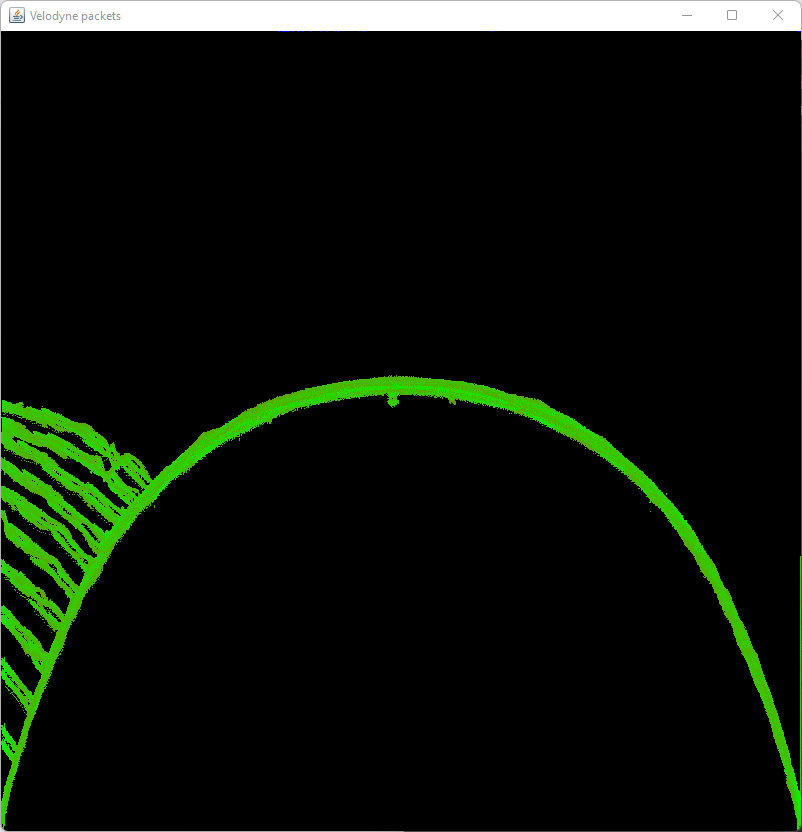
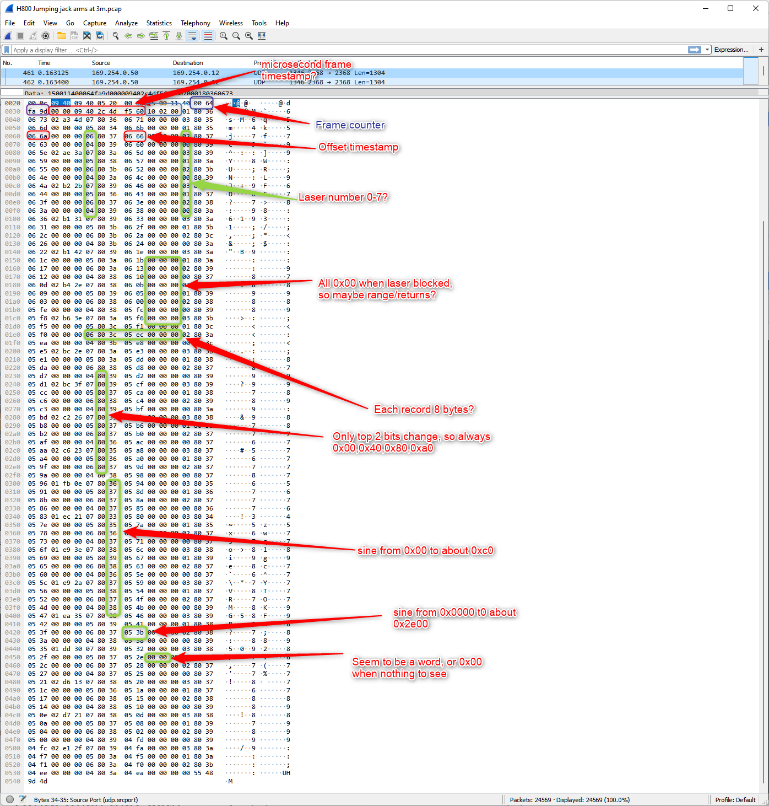

This project attempts to show some kind of visual representation of the data squirting out of a Velodyne Velarray V800 LiDAR unit. Since the output protocol is not documented and the calibration files are not available, we are left to wander in the dark and see if we can figure it out on our own.

Here is how to connect the V800 to the computer...
[Connections](connection.MD)

This version does a very poor job, but at least there is *some* visible stuff happening that maps to the real world. 

Here is a screenshot...

   

This is the view of a flat wall with my monitor obstructing to the left. Counter intuitively, the source is at the TOP of the frame and the wall looks bent because, from the unit's point of view, the wall gets farther away as it moves away from the centerline. I think the streamers are just the misaligned views of the edge of the monitor from the different lasers or sensors.

All the meat is in the `renderPacket()` function so start there. I make no promises that any parsing I've done is at all correct! It clearly is not! 

Also note that there is a field for what looks like a laser index number, and from the data it seems like there are 8 of them. Looking at the data visually it seems you need to apply an offset to each laser.

Here are my notes based on looking at about a trillion packets with wireshark... (but you should not trust these at all!)

Please let me know if you figure this out!

(Created with InjelliJ Community Edition) 

-josh  

 
